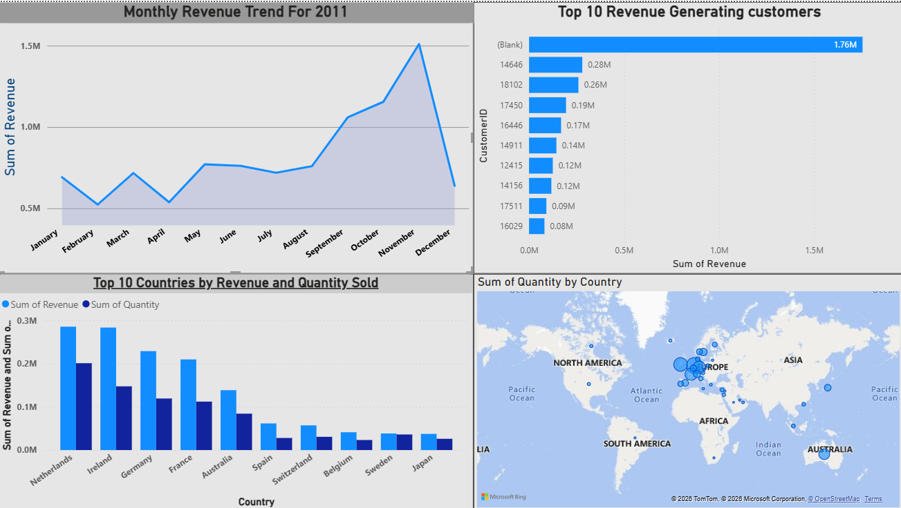

# 📊 Data Visualisation & Business Insights Project

## 📌 Project Overview

This project was completed as part of the **Data Visualisation & Business Insights Job Simulation**.

The objective was to analyze structured business data, evaluate operational performance, and develop an executive-level dashboard to support strategic decision-making.

The project focuses on transforming raw business data into actionable insights using business intelligence techniques and data storytelling.

---

## 🎯 Business Objectives

- Identify and track critical KPIs  
- Analyze revenue trends and sales performance  
- Evaluate regional performance  
- Understand product-wise contribution to revenue  
- Detect operational inefficiencies  
- Provide data-driven strategic recommendations  

---

## 📈 Dashboard Features  
- Revenue trend line chart  
- Regional performance comparison  
- Product revenue contribution analysis  
- Store-wise revenue breakdown  
- Payment method distribution visualization  

---

## 🛠 Tools & Technologies Used

- Power BI    
- Data Cleaning & Validation  
- Business Performance Analysis  
- Executive Reporting  

---

## 📸 Dashboard Preview

---

## 🎤 Executive Presentation

Delivered a structured **5-minute executive video presentation with voiceover** explaining:

- Revenue growth trends  
- Regional performance insights  
- Product-wise sales contribution  
- Payment behavior patterns  
- Operational performance indicators  
- Strategic business recommendations  

The presentation was designed for simulated CMO and CEO stakeholders, focusing on clear data storytelling and executive-level communication.

---

## 🚀 Business Impact

- Improved visibility into overall business performance  
- Enabled quick KPI tracking for leadership  
- Identified high-performing regions and products  
- Highlighted potential areas for operational improvement  
- Strengthened data-driven decision-making  

---

## 💼 Skills Demonstrated

- Business Intelligence  
- Data Visualization  
- Executive Communication  
- Analytical Thinking  
- Data Storytelling  

---

⭐ Turning data into strategic business insights.
